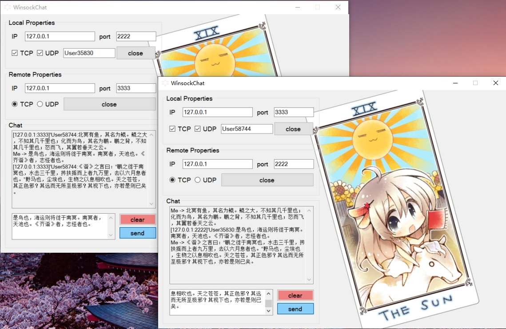

# WSChatDLL
a simall chat software 's dll   



## Explain   
GUI --> https://github.com/fumiama/WinsockChat    

## API
```c
#define CHAT_MODE_UDP (1)
#define CHAT_MODE_TCP (2)

int  Init(void (*f) (const char* msg, int msglen)); // f print msg to chat
int  ServerStart(const char* ip, unsigned short* port, const char* name, int mode);
int  ServerClose();
int  ClientConnect(const char* ip, unsigned short port, int mode);
int  ClientSendMessage(const char* msg, int msglen);
int  ClientClose();
void Defer();
```

